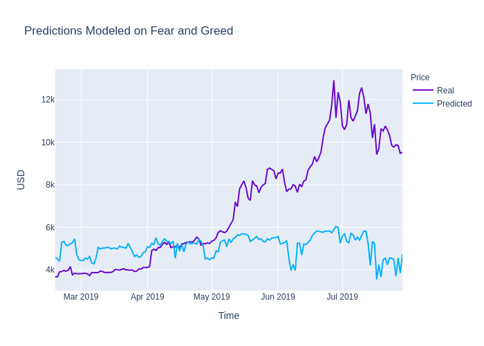
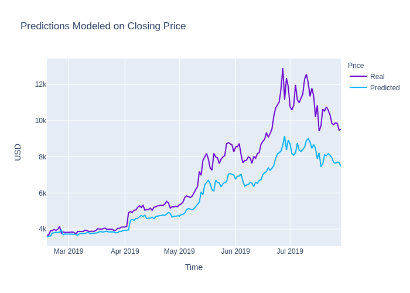

# 🐍₿📈 LSTM Stock Predictor 📉₿🐍

This project compares the performance of deep learning recurrent neural networks predicting Bitcoin closing price to see which feature is a better signal to use for modeling.  One uses the [Crypto Fear and Greed Index (FNG)](https://alternative.me/crypto/fear-and-greed-index/) and one uses closing price.

- - -

## Files

[Closing Prices Notebook](Code/lstm_stock_predictor_closing.ipynb)

[FNG Notebook](Code/lstm_stock_predictor_fng.ipynb)

- - -
## Evaluation of Model Performance

### Question 1: Which model has a lower loss? 
### Answer: The closing price model

### Question 2: Which model tracks the actual values better over time?
### Answer: The closing price model

### Question 3: Which window size works best for the model?
### Answer: A window size of 1 worked the best out of the range 1-10

- - -

